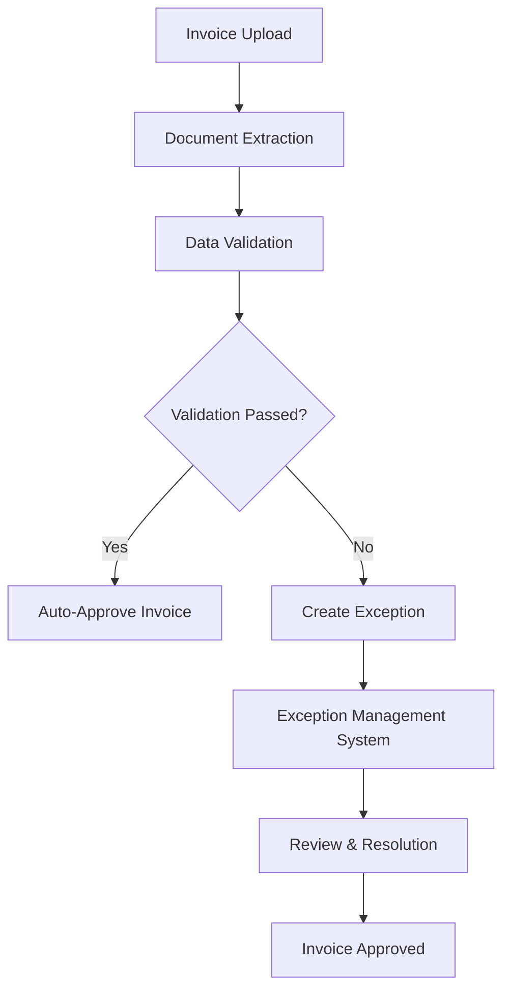

# Exception Management Integration Example

This document demonstrates how the exception management system integrates with the existing AP Intake invoice processing workflow.

## Workflow Integration

### 1. Invoice Processing Flow



### 2. Exception Creation Process

When invoice processing fails validation, the system automatically creates exceptions:

```python
# app/services/validation_service.py

class ValidationService:
    async def validate_invoice(self, extraction_result: InvoiceExtractionResult) -> ValidationResult:
        issues = []

        # Check confidence scores
        if extraction_result.confidence.overall < settings.DOCLING_CONFIDENCE_THRESHOLD:
            issues.append(ExceptionIssue(
                reason_code="low_confidence_extraction",
                severity=self._calculate_severity(extraction_result.confidence.overall),
                affected_fields=self._get_low_confidence_fields(extraction_result),
                message=f"Overall confidence {extraction_result.confidence.overall:.2f} below threshold {settings.DOCLING_CONFIDENCE_THRESHOLD}"
            ))

        # Check required fields
        if not extraction_result.header.invoice_number:
            issues.append(ExceptionIssue(
                reason_code="missing_required_fields",
                severity="high",
                affected_fields=[{"field_name": "invoice_number", "current_value": None}],
                message="Invoice number is required but missing"
            ))

        # Check vendor recognition
        if not extraction_result.header.vendor_name:
            issues.append(ExceptionIssue(
                reason_code="vendor_not_found",
                severity="medium",
                affected_fields=[{"field_name": "vendor_name", "current_value": None}],
                message="Vendor could not be identified from document"
            ))

        # Create exception record if issues found
        if issues:
            await self._create_exception(extraction_result.invoice_id, issues)

        return ValidationResult(
            passed=len(issues) == 0,
            issues=issues,
            requires_human_review=len(issues) > 0
        )
```

### 3. Exception Record Creation

```python
# app/services/exception_service.py

async def create_exception(
    self,
    invoice_id: str,
    issues: List[ExceptionIssue]
) -> Exception:
    """Create exception records for validation issues."""

    exceptions = []

    for issue in issues:
        exception = Exception(
            invoice_id=invoice_id,
            reason_code=issue.reason_code,
            severity=issue.severity,
            title=self._generate_exception_title(issue),
            description=issue.message,
            overall_confidence=self._calculate_overall_confidence(issue),
            min_confidence_threshold=settings.DOCLING_CONFIDENCE_THRESHOLD,
            details_json={
                "affected_fields": issue.affected_fields,
                "validation_context": issue.context,
                "extraction_data": issue.extraction_data
            },
            status="open",
            created_by="system"
        )

        exceptions.append(exception)

    # Save to database
    await self.db.save_all(exceptions)

    # Send notifications
    await self._notify_team_members(exceptions)

    return exceptions
```

## Frontend Integration

### 1. Invoice Dashboard Integration

The existing invoice dashboard shows exception indicators:

```tsx
// web/components/invoice/InvoiceDashboard.tsx

const InvoiceDashboard = () => {
  const { invoices } = useInvoices();

  const getExceptionIndicator = (invoice: Invoice) => {
    if (invoice.requires_human_review) {
      return (
        <Badge variant="destructive" className="ml-2">
          <AlertTriangle className="w-3 h-3 mr-1" />
          Exception
        </Badge>
      );
    }
    return null;
  };

  return (
    <Table>
      {/* ... existing table code ... */}
      <TableRow>
        <TableCell>
          <div className="flex items-center gap-2">
            <span className="font-mono">{invoice.invoiceNumber}</span>
            {getExceptionIndicator(invoice)}
          </div>
        </TableCell>
        {/* ... other cells ... */}
      </TableRow>
    </Table>
  );
};
```

### 2. Navigation Integration

Add exception management to the main navigation:

```tsx
// web/components/layout/Navigation.tsx

const Navigation = () => {
  const navigationItems = [
    { name: "Dashboard", href: "/", icon: BarChart3 },
    { name: "Invoices", href: "/invoices", icon: FileText },
    { name: "Exceptions", href: "/exceptions", icon: AlertTriangle }, // New
    { name: "Analytics", href: "/analytics", icon: TrendingUp },
  ];

  return (
    <nav>
      {navigationItems.map((item) => (
        <Link key={item.name} href={item.href}>
          <item.icon className="w-4 h-4" />
          {item.name}
        </Link>
      ))}
    </nav>
  );
};
```

### 3. Exception Count Badge

Show real-time exception count in navigation:

```tsx
// web/components/layout/Navigation.tsx

const Navigation = () => {
  const { analytics } = useExceptionAnalytics();

  return (
    <Link href="/exceptions" className="relative">
      <AlertTriangle className="w-4 h-4" />
      Exceptions
      {analytics?.open_exceptions > 0 && (
        <Badge className="absolute -top-1 -right-1 h-5 w-5 rounded-full p-0 text-xs">
          {analytics.open_exceptions}
        </Badge>
      )}
    </Link>
  );
};
```

## API Integration

### 1. Exception Status Updates

Update invoice status when exceptions are resolved:

```python
# app/api/api_v1/endpoints/exceptions.py

@router.post("/{exception_id}/resolve")
async def resolve_exception(
    exception_id: str,
    resolution_data: Dict[str, Any],
    db: AsyncSession = Depends(get_db)
):
    """Resolve exception and update invoice status."""

    # Resolve the exception
    exception = await exception_service.resolve_exception(
        exception_id=exception_id,
        resolution_data=resolution_data,
        session=db
    )

    # Check if all exceptions for this invoice are resolved
    remaining_exceptions = await exception_service.count_open_exceptions(
        invoice_id=exception.invoice_id,
        session=db
    )

    if remaining_exceptions == 0:
        # Update invoice status to ready for processing
        await invoice_service.update_status(
            invoice_id=exception.invoice_id,
            status=InvoiceStatus.READY,
            session=db
        )

        # Trigger background processing
        await process_invoice_task.delay(exception.invoice_id)

    return {
        "message": "Exception resolved successfully",
        "invoice_status": "ready" if remaining_exceptions == 0 else "exception"
    }
```

### 2. Real-time Updates

WebSocket integration for real-time exception updates:

```python
# app/api/websockets/exceptions.py

@app.websocket("/ws/exceptions")
async def exception_websocket(websocket: WebSocket):
    await websocket.accept()

    try:
        while True:
            # Listen for exception updates
            data = await websocket.receive_text()
            message = json.loads(data)

            if message["type"] == "exception_created":
                await websocket.send_json({
                    "type": "exception_update",
                    "data": {
                        "action": "created",
                        "exception_id": message["exception_id"],
                        "invoice_id": message["invoice_id"]
                    }
                })

            elif message["type"] == "exception_resolved":
                await websocket.send_json({
                    "type": "exception_update",
                    "data": {
                        "action": "resolved",
                        "exception_id": message["exception_id"],
                        "resolved_by": message["resolved_by"]
                    }
                })

    except WebSocketDisconnect:
        pass
```

## Database Integration

### 1. Exception Model

The exception model integrates with existing invoice models:

```python
# app/models/invoice.py

class Exception(Base, UUIDMixin, TimestampMixin):
    """Exception records for failed validations."""

    __tablename__ = "exceptions"

    # Relationship with invoice
    invoice_id = Column(UUID(as_uuid=True), ForeignKey("invoices.id"), nullable=False)

    # Exception details
    reason_code = Column(String(50), nullable=False, index=True)
    severity = Column(Enum(ExceptionSeverity), nullable=False)
    status = Column(Enum(ExceptionStatus), default=ExceptionStatus.OPEN)

    # Resolution tracking
    resolved_by = Column(String(255), nullable=True)
    resolved_at = Column(DateTime(timezone=True), nullable=True)
    resolution_method = Column(String(50), nullable=True)
    resolution_notes = Column(Text, nullable=True)

    # Relationships
    invoice = relationship("Invoice", back_populates="exceptions")

    def __repr__(self):
        return f"<Exception(id={self.id}, reason={self.reason_code}, status={self.status})>"
```

### 2. Invoice Model Updates

Update invoice model to include exception relationship:

```python
# app/models/invoice.py

class Invoice(Base, UUIDMixin, TimestampMixin):
    # ... existing fields ...

    # Exception relationship
    exceptions = relationship("Exception", back_populates="invoice", cascade="all, delete-orphan")

    @property
    def requires_human_review(self) -> bool:
        """Check if invoice has unresolved exceptions."""
        return any(
            exc.status in [ExceptionStatus.OPEN, ExceptionStatus.IN_PROGRESS]
            for exc in self.exceptions
        )

    @property
    def exception_count(self) -> int:
        """Get count of unresolved exceptions."""
        return len([
            exc for exc in self.exceptions
            if exc.status in [ExceptionStatus.OPEN, ExceptionStatus.IN_PROGRESS]
        ])
```

## Background Task Integration

### 1. Exception Creation Tasks

Create exceptions during invoice processing:

```python
# app/workers/invoice_tasks.py

from celery import Celery
from app.services.exception_service import ExceptionService

@celery.task
def process_invoice_with_exception_handling(invoice_id: str):
    """Process invoice with automatic exception handling."""

    try:
        # Process invoice normally
        result = process_invoice(invoice_id)

        # Check for validation issues
        if not result.validation_passed:
            exception_service = ExceptionService()
            await exception_service.create_exceptions_from_validation(
                invoice_id=invoice_id,
                validation_issues=result.issues
            )

            # Update invoice status
            await update_invoice_status(invoice_id, InvoiceStatus.EXCEPTION)

        return result

    except Exception as e:
        # Create system exception for processing errors
        await create_system_exception(invoice_id, str(e))
        raise
```

### 2. Exception Resolution Tasks

Background task for batch exception resolution:

```python
# app/workers/exception_tasks.py

@celery.task
def batch_resolve_exceptions(
    exception_ids: List[str],
    resolution_method: str,
    resolution_notes: str,
    resolved_by: str
):
    """Background task for batch exception resolution."""

    exception_service = ExceptionService()

    results = {
        "resolved": [],
        "failed": []
    }

    for exception_id in exception_ids:
        try:
            await exception_service.resolve_exception(
                exception_id=exception_id,
                resolution_method=resolution_method,
                resolution_notes=resolution_notes,
                resolved_by=resolved_by
            )
            results["resolved"].append(exception_id)

        except Exception as e:
            results["failed"].append({
                "exception_id": exception_id,
                "error": str(e)
            })

    # Send completion notification
    await send_batch_resolution_notification(results, resolved_by)

    return results
```

## Testing Integration

### 1. Exception Creation Tests

```python
# tests/test_exception_integration.py

async def test_exception_creation_during_validation():
    """Test that exceptions are created during validation failures."""

    # Create test invoice with low confidence extraction
    invoice = await create_test_invoice()
    extraction = InvoiceExtractionResult(
        header=InvoiceHeader(
            invoice_number=None,  # Missing required field
            vendor_name=None,     # Missing required field
            total_amount=100.0
        ),
        confidence=ConfidenceScores(
            overall=0.65,  # Below threshold
            invoice_number_confidence=0.0,
            vendor_confidence=0.0
        )
    )

    # Run validation
    validation_service = ValidationService()
    result = await validation_service.validate_invoice(extraction)

    # Assert exceptions were created
    assert not result.passed
    assert result.requires_human_review

    # Check exception records
    exceptions = await get_exceptions_for_invoice(invoice.id)
    assert len(exceptions) >= 2  # missing fields + low confidence

    reason_codes = [exc.reason_code for exc in exceptions]
    assert "missing_required_fields" in reason_codes
    assert "low_confidence_extraction" in reason_codes
```

### 2. Exception Resolution Tests

```python
async def test_exception_resolution_updates_invoice_status():
    """Test that resolving exceptions updates invoice status."""

    # Create invoice with exceptions
    invoice = await create_invoice_with_exceptions()

    # Resolve all exceptions
    exception_service = ExceptionService()
    await exception_service.resolve_all_exceptions(
        invoice_id=invoice.id,
        resolution_method="manual_correction",
        resolved_by="test_user"
    )

    # Check invoice status updated
    updated_invoice = await get_invoice(invoice.id)
    assert updated_invoice.status == InvoiceStatus.READY

    # Check no open exceptions remain
    open_exceptions = await exception_service.count_open_exceptions(invoice.id)
    assert open_exceptions == 0
```

## Monitoring and Metrics

### 1. Exception Metrics

Monitor exception metrics alongside invoice processing metrics:

```python
# app/metrics/exception_metrics.py

from prometheus_client import Counter, Histogram, Gauge

# Exception metrics
EXCEPTIONS_CREATED = Counter('exceptions_created_total', 'Total exceptions created', ['reason_code', 'severity'])
EXCEPTIONS_RESOLVED = Counter('exceptions_resolved_total', 'Total exceptions resolved', ['resolution_method'])
RESOLUTION_TIME = Histogram('exception_resolution_time_hours', 'Exception resolution time in hours')
OPEN_EXCEPTIONS = Gauge('open_exceptions_total', 'Number of open exceptions')

async def record_exception_created(exception: Exception):
    """Record exception creation metrics."""
    EXCEPTIONS_CREATED.labels(
        reason_code=exception.reason_code,
        severity=exception.severity
    ).inc()

async def record_exception_resolved(exception: Exception):
    """Record exception resolution metrics."""
    if exception.resolved_at:
        resolution_time = (exception.resolved_at - exception.created_at).total_seconds() / 3600
        RESOLUTION_TIME.observe(resolution_time)

    EXCEPTIONS_RESOLVED.labels(
        resolution_method=exception.resolution_method or 'unknown'
    ).inc()
```

### 2. Dashboard Integration

Add exception metrics to existing monitoring dashboard:

```python
# app/monitoring/dashboard.py

def get_dashboard_metrics():
    """Get comprehensive dashboard metrics including exceptions."""

    return {
        "invoice_metrics": {
            "total_invoices": get_total_invoices(),
            "processing_rate": get_processing_rate(),
            "avg_processing_time": get_avg_processing_time()
        },
        "exception_metrics": {
            "total_exceptions": get_total_exceptions(),
            "open_exceptions": get_open_exceptions(),
            "resolution_rate": get_exception_resolution_rate(),
            "avg_resolution_time": get_avg_resolution_time()
        },
        "system_health": {
            "api_response_time": get_api_response_time(),
            "error_rate": get_error_rate(),
            "queue_size": get_queue_size()
        }
    }
```

This integration example demonstrates how the exception management system seamlessly integrates with the existing AP Intake workflow, providing comprehensive exception handling while maintaining the existing invoice processing capabilities.